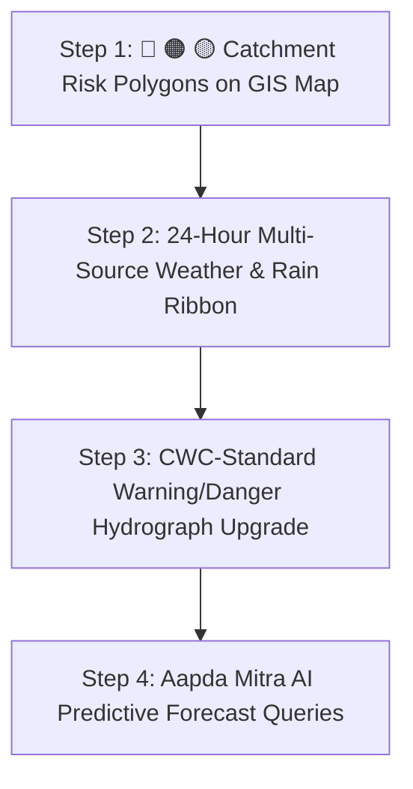

# 🌊 VIGIL-FLOOD: Core Functionality vs. Feature Enhancement Breakdown

> **Reference Problem Statement ID:** 26192 (MHA / NDRF)  
> **Mandate:** Hyper-Local Early Warning & Multi-Hazard Prediction System for Hilly Regions (Flash Floods, Debris Flows & Landslides)  
> **Target Pilot:** Beas River Valley, Mandi District, Himachal Pradesh  

---

## 🎯 1. Direct Core Functionality vs. Enhancement Features

To ensure maximum alignment with MHA/NDRF requirements and maintain an uncluttered **Single Pane of Glass** command center, here is the distinct classification of every idea discussed:

```
+----------------------------------------------------------------------------------------------------+
| ⚡ CORE FUNCTIONALITY (Solves Problem #26192)      | 🎨 ENHANCEMENT FEATURES (UI / UX / Intelligence) |
+----------------------------------------------------+-----------------------------------------------+
| 1. Multi-Horizon Predictive Lead Time (+3h/+24h)   | 1. Google Weather-Style 24h Interactive Ribbon|
| 2. Standard 3-Tier Risk Gradation (🔴 🟠 🟡)       | 2. Multi-Layer Threat Contours Drawer Toggle  |
| 3. CWC Official Warning/Danger Hydrographs         | 3. Dynamic Interactive Map FlyTo Zoom         |
| 4. Coupled Mountain Runoff & Slope Stability Fusion| 4. Natural-Language Forecast Chat (Aapda Mitra)|
+----------------------------------------------------------------------------------------------------+
```

---

## ⚡ Part 1: Items That Solve Our CORE FUNCTIONALITY

These components directly satisfy mandatory technical criteria of Problem Statement #26192:

| # | Core Capability | Why It Solves the Core Mandate | CWC / NDMA / NDRF Standard |
|---|---|---|---|
| **C1** | **Predictive Hydrograph Cresting (+3h / +6h / +24h Horizon)** | Solves the #1 requirement: *"Providing sufficient actionable lead time for evacuation"*. Instead of just showing current water stage, it predicts peak crest time. | CWC Stage Hydrograph Baselines |
| **C2** | **Standard 3-Tier Hazard Buffer Polygons (🔴 Extreme, 🟠 Danger, 🟡 Warning)** | Solves *"hyper-local resolution at village/ward level"* by classifying exact impact zones rather than single dots. | NDMA Standard Buffer Zoning Protocol |
| **C3** | **Official Gauge Baselines (Warning / Danger / High Flood Level)** | Embeds standardized CWC benchmark lines ($14\text{ m}$, $16\text{ m}$, $18\text{ m}$) so disaster officers know the precise severity context. | Central Water Commission (CWC) Early Warning Standards |
| **C4** | **Coupled Flash-Flood & Slope Tilt Telemetry Fusion** | Fulfills *"integrates rainfall data, soil moisture sensors, slope stability models... for hilly regions"*. | MHA / NDRF Multi-Hazard Coupled Guideline |

---

## 🎨 Part 2: High-Impact TACTICAL FEATURES & UI ENHANCEMENTS

These features make the system intuitive, responsive, and Big-Tech grade without cluttering the screen:

| # | Feature Name | Description & Visual Interaction | Screen Location |
|---|---|---|---|
| **F1** | **24-Hour Google Weather Ribbon** | Collapsible top ribbon with interactive tabs (`[🌡️ Temperature]`, `[🌧️ Precipitation %]`, `[💨 Wind Speed]`) driven by real-time Open-Meteo feeds. | Top Center (Above GIS Map) |
| **F2** | **Tactical Map Layer Filter Drawer** | Layer toggle allowing commanders to turn on/off Catchment Polygons, IoT Gauges, SAR Inundation, and Evacuation Routes on demand. | GIS Map Top-Right Control |
| **F3** | **National-to-Local Interactive Drilldown** | Smooth camera flyover from All-India strategic map (`[22.5° N, 78.9° E, Zoom: 5]`) to hyper-local village gorge (`Zoom: 13.5`), with clean layer cleanup on deselect. | Tactical Map & Village Selector |
| **F4** | **Aapda Mitra Temporal AI Forecast Q&A** | Connects predictive hydrographs and rainfall forecasts to the AI chat (*"When is the flood peak expected in Pandoh?"*). | Right Panel AI Assistant |

---

## 🗺️ 2. Recommended Implementation Roadmap (Step-by-Step)



### 📍 Step 1: Regional Catchment Risk Polygons (Core + Visual)
- **Goal:** Render semi-transparent hazard contours (🔴 Extreme $>75\%$, 🟠 Danger $50-74\%$, 🟡 Warning $25-49\%$) over the Beas River corridor (Pandoh $\rightarrow$ Aut $\rightarrow$ Thalot).
- **Control:** Easily toggleable via the map layer controls.

### 🌤️ Step 2: 24-Hour Google Weather & Rain Forecast Ribbon (Feature)
- **Goal:** Add a sleek, collapsible atmospheric ribbon docked above the map showing hourly precipitation curves, humidity, and barometric pressure trends.
- **Source:** Free real-time Open-Meteo API for Mandi / Pandoh coordinates (`31.67° N, 77.06° E`).

### 📈 Step 3: Google Flood Hub & CWC Hydrograph Upgrade (Core)
- **Goal:** Upgrade the station click modal with clear horizontal baseline threshold lines:
  - 🟡 **Warning Level** ($14.0\text{ m}$)
  - 🟠 **Danger Level** ($16.0\text{ m}$)
  - 🔴 **Extreme Level** ($18.0\text{ m}$)
  - **NOW** vertical divider with $+24\text{h}$ dotted predictive crest projection curve.

### 🤖 Step 4: Aapda Mitra AI Integration (Intelligence Feature)
- **Goal:** Allow the AI assistant to read live 24h weather and river crest projections to provide immediate voice/text advisory answers.
